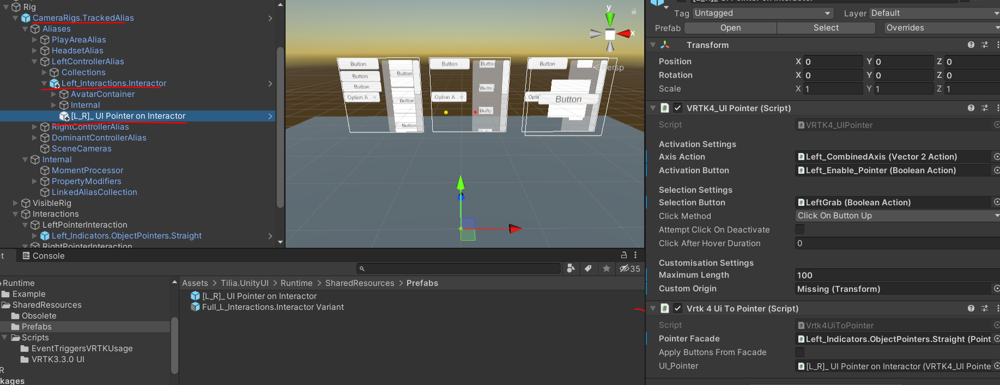

[![Tilia logo][Tilia-Image]](#)

> ### Tilia Unity UI Unity Editor 2017 +
> Unity UI with UI Pointers.

[![Release][Version-Release]][Releases]
[![License][License-Badge]][License]

## Introduction

Support for Unity UI. Both New and Old input systems

> **Requires** Unity Editor 2017.4 +

![Full_Animation]

## Use cases:

This package only covers: 

- use case with a **UI layer** for casting UI elements.
- 3d casting on world object to enable support for default Unity Event Triggers

## Setup: 

1) Place **VRTK4_UICanvas** on each canvas
    - ON ALL UI ELEMENTS - buttons, sliders, inputfields, toggles, dropdown -> YOU MUST REMOVE DEFAULT UNITY NAVIGATION (**navigation = none**)!
    - You may leave Blocking mask as None (this way you will save on performance - no 3D raycasts will be performed)

2) If you need drag and drop functionality on the UI: enable **supportDragAndDropUI** on the **VRTK4_UICanvas** (use custom gameobject with name **CANVAS_DRAGGABLE_PANEL**, or default one will generated). Note : default CANVAS_DRAGGABLE_PANEL is placed first,it will block all previous canvases or canvases that are behind it.  

2) To ignore player objects : use component **VRTK4_PlayerObject**

3) If you are using **Pseudobody** - add pointers to the **IgnoredGameObjectList**

4) Just as with standart unity 3D raycasting (enabling cast on world objects) : Add **VRTK4_3DGraphicRaycaster** and setup interactive layers. See here : ![Vrtk3DCasts]

Other important notes:

- When using animations on the UI canvas: add box collider on it in Editor mode, otherwise UI colliders are created at the Awake, with canvas delta size ( example animation from small to large size).

- When using Unity Event Triggers: pointers will always perform their separate OnEnter/OnExit -> so please see **TiliaUnityEventTriggerSubscriber** correct usage script

- All input fields must hide soft keyboard and hide mobile input. There is no default keyboard in this package. Please use custom one.

- When using input fields:  VR + Input field caret is not working properly. Make sure to use custom caret script. Example see here -> https://gist.github.com/studentutu/714d78ad6cebfe147bfa852fb7046a90

## Getting Started

Please refer to the [installation] guide to install this package.

See full scene and a separate prefab here :

/Runtime/Example/TestScene -> here is a full scene with Custom Rig and UI Pointers attached. 
Note : on the Event system added VRTK4_EventSystem, VRTK4_VRInputModule, VRTK4_3DGraphicRaycaster

/Runtime/SharedResources/Prefabs/[L_R]_ UI Pointer on Interactor.prefab  -> default UI Pointer, needs additional setup with Pointer, actions and PointerFacade

/Runtime/SharedResources/Prefabs/Full_L_Interactions.Interactor Variant.prefab -> FUll Tilia Pointer with attached UI Pointer

## Documentation

Please refer to the [How To Guides] for usage of this package.

Further documentation can be found within the [Documentation] directory and at https://academy.vrtk.io

## Contributing

Please refer to the Extend Reality [Contributing guidelines] and the [project coding conventions].

## Code of Conduct

Please refer to the Extend Reality [Code of Conduct].

## License

Code released under the [MIT License][License].

[License-Badge]: https://img.shields.io/github/license/ExtendRealityLtd/Tilia.Utilities.Shaders.Unity.svg

[Version-Release]: https://img.shields.io/badge/package-2.0.1-blue

[project coding conventions]: https://github.com/ExtendRealityLtd/.github/blob/master/CONVENTIONS/UNITY3D.md

[Tilia-Image]: https://user-images.githubusercontent.com/1029673/67681496-5bf10700-f985-11e9-9413-e61801b6eab5.png

[License]: LICENSE.md

[Documentation]: Documentation/

[How To Guides]: Documentation/HowToGuides/

[Installation]: Documentation/HowToGuides/Installation/README.md

[Backlog-Badge]: https://img.shields.io/badge/project-backlog-78bdf2.svg

[Releases]: ../../releases

[Contributing guidelines]: https://github.com/ExtendRealityLtd/.github/blob/master/CONTRIBUTING.md

[Code of Conduct]: https://github.com/ExtendRealityLtd/.github/blob/master/CODE_OF_CONDUCT.md

[Full_Animation]: ./Documentation/HowToGuides/Installation/Animation.gif

[Vrtk3DCasts]: ./Documentation/HowToGuides/Installation/Tillia3DCasts.PNG